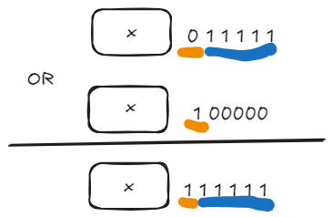

（以后我要坚持日更。）今日的每日一题：[3314. 构造最小位运算数组 I - 力扣（LeetCode）](https://leetcode.cn/problems/construct-the-minimum-bitwise-array-i/description/?envType=daily-question&envId=2026-01-20)
# 题目：构造最小位运算数组

给你一个长度为 `n` 的质数数组 `nums` 。你的任务是返回一个长度为 `n` 的数组 `ans` ，对于每个下标 `i` ，以下 **条件** 均成立：

- `ans[i] OR (ans[i] + 1) == nums[i]`

除此以外，你需要 **最小化** 结果数组里每一个 `ans[i]` 。

如果没法找到符合 **条件** 的 `ans[i]` ，那么 `ans[i] = -1` 。

**质数** 指的是一个大于 1 的自然数，且它只有 1 和自己两个因数。

**示例 1：**

**输入：** nums = [2,3,5,7]

**输出：**[-1,1,4,3]

**解释：**

- 对于 `i = 0` ，不存在 `ans[0]` 满足 `ans[0] OR (ans[0] + 1) = 2` ，所以 `ans[0] = -1` 。
- 对于 `i = 1` ，满足 `ans[1] OR (ans[1] + 1) = 3` 的最小 `ans[1]` 为 `1` ，因为 `1 OR (1 + 1) = 3` 。
- 对于 `i = 2` ，满足 `ans[2] OR (ans[2] + 1) = 5` 的最小 `ans[2]` 为 `4` ，因为 `4 OR (4 + 1) = 5` 。
- 对于 `i = 3` ，满足 `ans[3] OR (ans[3] + 1) = 7` 的最小 `ans[3]` 为 `3` ，因为 `3 OR (3 + 1) = 7` 。

**示例 2：**

**输入：** nums = [11,13,31]

**输出：**[9,12,15]

**解释：**

- 对于 `i = 0` ，满足 `ans[0] OR (ans[0] + 1) = 11` 的最小 `ans[0]` 为 `9` ，因为 `9 OR (9 + 1) = 11` 。
- 对于 `i = 1` ，满足 `ans[1] OR (ans[1] + 1) = 13` 的最小 `ans[1]` 为 `12` ，因为 `12 OR (12 + 1) = 13` 。
- 对于 `i = 2` ，满足 `ans[2] OR (ans[2] + 1) = 31` 的最小 `ans[2]` 为 `15` ，因为 `15 OR (15 + 1) = 31` 。

**提示：**

- `1 <= nums.length <= 100`
- `2 <= nums[i] <= 1000`
- `nums[i]` 是一个质数。

# 思路1
涉及到按位或运算，可以多举几个例子，关注ans和nums的关系。

首先ans和ans+1这两个数一定是**一个奇数一个偶数**，那么二进制展开后最后一位一定是0和1，那么或运算得到的最后一位一定是1.所以反推：偶数nums是没有这样的ans的，即2不行。

然后，对于ans，**如果最后有连续的一串1**，经过与自增1或运算之后，得到的nums也会有同样数量的1，而ans中**最右的0会变成1**.即若$ans = x+2^k -1$,则可得$nu ms = x+2^{k+1} -1$,具体如图示。


则可根据nums来反推ans了，**若nums有一串连续的1，则只需将这一串连续1的最左的1变成0即可得到ans**：

$$对于3(011),有连续的11，则可推得ans=001，即1$$
$$对于5(101),有连续的1，则可推得ans=100,即4$$
$$对于7(111),有连续的111，则可推得ans=011，即3$$
这样理解之后，代码逻辑也可以得到了，**即不断右移nums看得到的是不是1，如果从一开始一直到某位均是1，而此时右移结果为0，则只需将最后得到的1变成0**。

给出代码：
```cpp
#include <iostream>
#include <vector>
using namespace std;

class Solution {
public:
    vector<int> minBitwiseArray(vector<int>& nums) {
        vector<int> results(nums.size());
        for(int i = 0;i < nums.size();i++){
            if (nums[i] == 2)results[i] = -1;
            else results[i]=minBitwise(nums[i]);
        }
        return results;
    }
    int minBitwise(int num) {
        int result = 0;
        for (int count = 0; num >= 0; num >>= 1, count++) {
            if (num % 2 == 0) {
                result = (num << count) + (1 << (count - 1)) - 1;
                break;
            }
        }
        return result;
    }
};

int main() {//测试用例
    Solution solution;
    vector<int> nums = { 2,3,5,7 };
    vector<int> results = solution.minBitwiseArray(nums);
    for (int i = 0; i < results.size(); i++) { cout << results[i]; }
    return 0;
}
```

而后看了官方题解也是这个思路，这个题目还是相对简单哈哈哈哈。
附上官方题解链接：[3314. 构造最小位运算数组 I - 力扣（LeetCode）](https://leetcode.cn/problems/construct-the-minimum-bitwise-array-i/solutions/3878889/gou-zao-zui-xiao-wei-yun-suan-shu-zu-i-b-1yc3/?envType=daily-question&envId=2026-01-20)


---
# 后记：为啥这样得到的ans是最小的呢？
我在第二天看到了力扣这个题目的升级版，需要找到最小的ans，然后我用原代码尝试了一下还是正确的，所以需要论证一下算法的正确性了。然后我问ai告诉我了哈哈哈哈。

### 1. 正确性证明 (Why it works)
对于方程 `ans | (ans + 1) == n`：
1. **变换性质**：运算 `x | (x + 1)` 的本质是将 $x$ 二进制表示中**最低位的 0 变为 1**。
2. **逆向推导**：既然 $n$ 是由 $ans$ 经过“把最低位 0 变 1”得到的，那么 $ans$ 一定等于 $n$ **把某一位 1 变回 0**。
3. **约束条件**：这个被变回 0 的位，必须能成为 $ans$ 的“最低位 0”。这意味着在 $ans$ 中，该位右边的所有位必须全都是 1。

**结论**：我们要找的那个位置，必须处于 $n$ **末尾连续的 1** 当中。算法中将被变回 0 的位置选在 $n$ 末尾连续 1 的最左边（最高位），这保证了该位置右边全是 1，即翻转回 0 后，该位成为了 lowest zero bit。这一点验证了算法构造出的 `ans` 是满足条件的合法解。

### 2. 最优性证明 (Why it is minimal)
题目要求**最小化** $ans$。
- 根据推导，$ans = n - 2^j$，其中 $j$ 是被翻转的那一位的下标。
- 要让 $ans$ 最小，必须让减去的 $2^j$ **最大**。
- 为了满足上述“$ans$ 在第 $j$ 位是最低位 0”的条件，$n$ 在第 $j$ 位以下必须全是 1。
- 因此，$j$ 只能选在 $n$ 末尾的那串连续 1 里面。

**结论**：为了让 $2^j$ 最大，我们必须选择**连续 1 中最高的那一位**（即最左边的 1）。
这正是算法代码逻辑的核心：找到末尾连续的 `1`，并将其中最高位的 `1` 变成 `0`。这一步减去了可能的最大 2 的幂次，从而保证了得到的 `ans` 是所有可行解中最小的。

