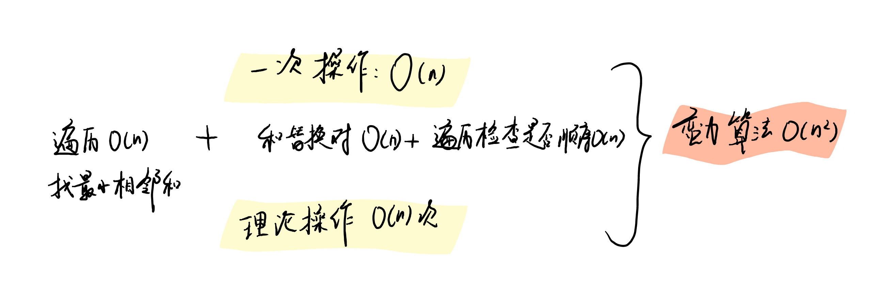

今天的每日一题：[3510. 移除最小数对使数组有序 II - 力扣（LeetCode）](https://leetcode.cn/problems/minimum-pair-removal-to-sort-array-ii/description/?envType=daily-question&envId=2026-01-23)


# 移除最小数使数组有序
给你一个数组 nums，你可以执行以下操作任意次数：

选择 相邻 元素对中 和最小 的一对。如果存在多个这样的对，选择最左边的一个。
用它们的和替换这对元素。
返回将数组变为 非递减 所需的 最小操作次数 。

如果一个数组中每个元素都大于或等于它前一个元素（如果存在的话），则称该数组为非递减。

 

示例 1：

输入： nums = [5,2,3,1]

输出： 2

解释：

元素对 (3,1) 的和最小，为 4。替换后 nums = [5,2,4]。
元素对 (2,4) 的和为 6。替换后 nums = [5,6]。
数组 nums 在两次操作后变为非递减。

示例 2：

输入： nums = [1,2,2]

输出： 0

解释：

数组 nums 已经是非递减的。

 

提示：

1 <= nums.length <= 105
-109 <= nums[i] <= 109

# 题解
首先来考虑暴力算法，
但这样会超时。。所以就得优化了。

题解来源于官方题解：[3510. 移除最小数对使数组有序 II - 力扣（LeetCode）](https://leetcode.cn/problems/minimum-pair-removal-to-sort-array-ii/solutions/3880129/yi-chu-zui-xiao-shu-dui-shi-shu-zu-you-x-klaf/?envType=daily-question&envId=2026-01-23)


# 方法一：优先队列 + 惰性删除
## 思路与算法

本题是「3507. 移除最小数对使数组有序 I」的数据增强版。朴素模拟在这个数据规模下会超时，故我们需要对原模拟过程中的三个关键逻辑进行优化：寻找最小相邻数对和、判断当前数组单调性以及合并最小相邻数对。

### 维护最小相邻数对和

首先考虑如何寻找最小相邻数对和，易想到使用优先队列来维护。将数对的引用存入优先队列，假设当前弹出的相邻数对为 (i,j)，那么完成合并操作后，原来位于 i−1 和 j+1 两个位置的元素会与合并后的新元素形成两个新的相邻数对，因此需要把新的数对加入优先队列。同时，原来 (i−1,i) 和 (j,j+1) 构成的两个数对（若存在）就变成了优先队列中的脏数据。此时一般使用惰性删除的技巧，即在弹出操作中判断弹出的是否是脏数据，而不是立刻在优先队列中删除对应元素，这也是此类题目的常见处理方法。

本题判断优先队列中的元素是否是脏数据有多种实现，这里提供一种思路，假设总是将数对向左合并，可以考虑维护两个信息：

用一个 merged 数组判断某个位置的元素是否已经被合并，只有两个元素都没被合并时，它们的引用才是有效的。
在存入数对时，同时存入当前的数对和。待弹出该数对时，即便两个元素都有效，如果数对和发生了变化，显然该数对也是脏数据。
该实现存在数对中的两个元素都有效且数对和不变，但仍是脏数据的极端情况。可以证明，此情况并不影响结果的正确性，因为在该情境下，即便该数对为脏数据，它依然是本轮合并的目标。

### 维护数组单调性

接下来是判断数组单调性，不难发现：相邻元素的单调性可以决定整个数组的单调性。故考虑维护一个变量 decreaseCount ，表示当前 nums 中有多少个相邻的数对是递减的。显然，当 decreaseCount 为 0 时 nums 即为非严格单调递增状态。

我们可以在合并数对 (i,j) 的过程维护 decreaseCount 的变化。分为三种情况考虑：

对于数对 (i,j)，若原来就满足 nums[i]>nums[j]，则 decreaseCount 应该减一。
若 i 不是首项元素，则考虑 nums[i−1] 与 nums[i] 在合并前后的单调性变化。如果从单调递减变成了非严格单调递增，则将 decreaseCount 减一，反之加一。
类似地，若 j 不是末项元素，则对 nums[j] 与 nums[j+1] 应用上述相同的逻辑进行更新。
此时 decreaseCount 是否为 0 就是外层循环的终止条件。

### 合并元素

经上述处理后，我们已经不需要直接遍历 nums，仅需要获取当前数对的前驱和后继，且合并元素必然会涉及到线性表的删除，显然此时使用双向链表维护 nums 最为合适。

优化上述三个逻辑后，再按照题意去模拟寻找最小数对并合并的流程，即可通过本题。

作者：力扣官方题解
链接：
来源：力扣（LeetCode）
著作权归作者所有。商业转载请联系作者获得授权，非商业转载请注明出处。

```c++
#include <iostream>
#include <vector>
#include <list>
#include <queue>
#include <bitset>

using namespace std;

typedef long long ll;

const int MAX_N = 100005;

struct Node {
    ll value;
    int left;
};

using ListIt = std::list<Node>::iterator;

struct Pair {
    ListIt first;
    ListIt second;
    ll cost;
    size_t firstLeft;
    size_t secondLeft;

    Pair() {}
    Pair(ListIt fi, ListIt se, ll cost)
        : first(fi), second(se), firstLeft(fi->left), secondLeft(se->left),
        cost(cost) {}
};

struct ComparePair {
    bool operator()(const Pair& a, const Pair& b) {
        if (a.cost != b.cost) {
            return a.cost > b.cost;
        }
        return a.firstLeft > b.firstLeft;
    }
};

class Solution {
public:
    int minimumPairRemoval(std::vector<int>& nums) {
        std::list<Node> list;
        std::bitset<MAX_N> merged;
        std::priority_queue<Pair, std::vector<Pair>, ComparePair> pq;

        int decreaseCount = 0;
        int count = 0;

        list.push_back({ nums[0], 0 });

        for (size_t i = 1; i < nums.size(); ++i) {
            list.push_back({ nums[i], (int)i });

            auto curr = std::prev(list.end());
            auto prev = std::prev(curr);

            pq.push({ prev, curr, prev->value + curr->value });

            if (nums[i - 1] > nums[i]) {
                decreaseCount++;
            }
        }

        while (decreaseCount > 0 && !pq.empty()) {
            auto top = pq.top();
            pq.pop();

            if (merged[top.firstLeft] || merged[top.secondLeft]) {
                continue;
            }

            auto first = top.first;
            auto second = top.second;
            auto cost = top.cost;

            if (first->value + second->value != cost) {
                continue;
            }

            count++;

            if (first->value > second->value) {
                decreaseCount--;
            }

            ListIt prev =
                (first == list.begin()) ? list.end() : std::prev(first);
            ListIt next = std::next(second);

            if (prev != list.end()) {
                if (prev->value > first->value && prev->value <= cost) {
                    decreaseCount--;
                }
                if (prev->value <= first->value && prev->value > cost) {
                    decreaseCount++;
                }
                pq.push({ prev, first, prev->value + cost });
            }

            if (next != list.end()) {
                if (second->value > next->value && cost <= next->value) {
                    decreaseCount--;
                }
                if (second->value <= next->value && cost > next->value) {
                    decreaseCount++;
                }
                pq.push({ first, next, cost + next->value });
            }

            first->value = cost;
            merged[second->left] = 1;
            list.erase(second);
        }

        return count;
    }
};


int main() {
    Solution solution;
    vector<int> nums = { 2,2,-1,3,-2,2,1,1,1,0,-1 };
    cout<<solution.minimumPairRemoval(nums)<<endl;
    return 0;
}
```

## 代码逐字逐句讲解

这段代码是一个 C++ 解决方案，用于解决“移除（或合并）最小数对使数组有序”的问题。算法的核心思想是**贪心**策略，配合**优先队列**（最小堆）和**双向链表**来高效地模拟合并过程，同时维护数组的有序性状态。

### 1. 引用头文件与命名空间

```cpp
#include <iostream>
#include <vector>
#include <list>
#include <queue>
#include <bitset>

using namespace std;
```

* **`<list>`**: 引入双向链表。
  * **为什么使用**：因为合并操作涉及到删除中间的元素。在 `std::vector`（数组）中删除中间元素是 $O(N)$ 的操作，会导致大量数据移动；而在 `std::list`（链表）中删除节点是 $O(1)$ 的操作。
* **`<queue>`**: 引入优先队列 (`priority_queue`)。
  * **为什么使用**：我们需要每次都快速找到“和最小”的相邻数对。优先队列可以在 $O(\log N)$ 时间内提供最小值。
* **`<bitset>`**: 引入位图。
  * **为什么使用**：用于标记某个原始下标的元素是否已经被合并（删除）。相比 `bool` 数组，它更节省空间。

### 2. 数据结构定义

#### Node 结构体

```cpp
struct Node {
    ll value;   // 节点的值 (long long 防止溢出)
    int left;   // 原始数组中的下标 (作为唯一ID使用)
};
```

* 链表中的每个节点存储当前的值和它在原始数组中的位置。位置 `left` 是为了在“惰性删除”时判断节点是否失效。

#### Iterator 类型定义

```cpp
using ListIt = std::list<Node>::iterator;
```

* `ListIt` 是链表迭代器的别名。**关键点**：`std::list` 的迭代器在链表其他位置发生插入或删除时**不会失效**（除了被删除的那个节点本身）。这使得我们可以安全地在优先队列中保存指向链表节点的指针（迭代器）。

#### Pair 结构体（优先队列的元素）

```cpp
struct Pair {
    ListIt first;       // 指向数对中左边元素的迭代器
    ListIt second;      // 指向数对中右边元素的迭代器
    ll cost;            // 数对的和 (合并后的代价)
    size_t firstLeft;   // 左元素的原始下标 (用于校验脏数据)
    size_t secondLeft;  // 右元素的原始下标 (用于校验脏数据)

    Pair() {}
    // 构造函数：初始化各个成员
    Pair(ListIt fi, ListIt se, ll cost)
        : first(fi), second(se), firstLeft(fi->left), secondLeft(se->left),
        cost(cost) {}
};
```

* 这个结构体封装了优先队列需要的所有信息。它保存了数对的迭代器，以便后续操作链表；保存了原始下标，用于判断这个数对是否已经被之前的操作处理过（即是否为“脏数据”）。

#### ComparePair 仿函数（比较器）

```cpp
struct ComparePair {
    bool operator()(const Pair& a, const Pair& b) {
        if (a.cost != b.cost) {
            return a.cost > b.cost; // 和更小的优先级更高 (最小堆)
        }
        return a.firstLeft > b.firstLeft; // 如果和相等，下标更小的优先级更高
    }
};
```

* **优先队列的排序规则**：
  * C++ 的 `priority_queue` 默认是**最大堆**（即 `Compare` 返回 `true` 时，`a` 会被排在 `b` 后面/下面，`b` 认为是“更大”的优先级）。
  * 这里 `a.cost > b.cost` 返回 `true`，意味着如果 `a` 的成本大，它被排在后面。这实际上构建了一个**最小堆**，堆顶是 `cost` 最小的元素。
  * **为什么要按 firstLeft 排序**：题目（通常此类贪心题）要求如果数值相同，优先处理左边的，保证操作的确定性。

### 3. Solution 类核心逻辑

#### 变量初始化

```cpp
int minimumPairRemoval(std::vector<int>& nums) {
    std::list<Node> list;
    std::bitset<MAX_N> merged; // 记录原始下标是否已合并
    // 定义优先队列，使用 vector 作为容器，ComparePair 作为比较规则
    std::priority_queue<Pair, std::vector<Pair>, ComparePair> pq;

    int decreaseCount = 0; // 核心变量：数组中有多少个“下降”的位置
    int count = 0;         // 记录操作次数
```

* `decreaseCount` 是判断数组是否有序的关键。如果 `decreaseCount == 0`，说明数组中没有任何 `nums[i] > nums[i+1]` 的情况，即数组是非递减有序的。

#### 构建链表与初始状态

```cpp
    list.push_back({ nums[0], 0 });

    for (size_t i = 1; i < nums.size(); ++i) {
        list.push_back({ nums[i], (int)i });

        // 获取链表中最后两个元素的迭代器
        auto curr = std::prev(list.end()); // 当前元素
        auto prev = std::prev(curr);       // 前一个元素

        // 将这对相邻元素放入优先队列
        pq.push({ prev, curr, prev->value + curr->value });

        // 统计初始的逆序对数量 (相邻逆序)
        if (nums[i - 1] > nums[i]) {
            decreaseCount++;
        }
    }
```

* **`std::prev(list.end())`**: 获取指向链表最后一个元素的迭代器。
* 这个循环做两件事：
  1. 将数组转化为链表，并将所有相邻数对推入堆中。
  2. 计算初始的 `decreaseCount`。例如 `[3, 1]` 是一个下降处，`decreaseCount` 加 1。

#### 主循环（贪心合并）

```cpp
    while (decreaseCount > 0 && !pq.empty()) {
        auto top = pq.top();
        pq.pop();
```

* **循环条件**：只要数组还不是有序的 (`decreaseCount > 0`) 且还有数对可以合并，就继续。

#### 惰性删除检查 (Lazy Deletion)

```cpp
        // 检查1: 通过原始下标检查节点是否已被删除 (脏数据)
        if (merged[top.firstLeft] || merged[top.secondLeft]) {
            continue; 
        }

        auto first = top.first;
        auto second = top.second;
        auto cost = top.cost;

        // 检查2: 检查节点的值是否在入队后发生了变化
        if (first->value + second->value != cost) {
            continue;
        }
```

* **原理**：当我们合并 A 和 B (A+B) 时，原来涉及 A 或 B 的其他数对（例如前一个元素与 A 的组合）在堆中依然存在。我们不费力去堆中搜索并删除它们，而是等到它们浮到堆顶时，检查它们的状态不合法（`merged` 为 true 或值对不上），直接丢弃。这就是**惰性删除**。

#### 执行合并并更新状态

```cpp
        count++; // 操作计数加一

        // 1. 处理被合并的两个节点本身的逆序关系
        if (first->value > second->value) {
            decreaseCount--; // 如果本来是 5, 2 (逆序)，合并成 7 后，这个逆序消失了
        }
```

* 这处理的是 `first` 和 `second` 内部的关系。

#### 更新邻居关系 (关键难点)

这里我们需要看合并后的新节点（值变为 `cost`，即 `sum`）与它左右邻居的关系变化。

```cpp
        ListIt prev = (first == list.begin()) ? list.end() : std::prev(first);
        ListIt next = std::next(second);

        // --- 处理左邻居 (prev) ---
        if (prev != list.end()) {
            // 情况A: 原来是 prev > first (坏的)，现在 prev <= sum (好的) -> 逆序减少
            if (prev->value > first->value && prev->value <= cost) {
                decreaseCount--;
            }
            // 情况B: 原来是 prev <= first (好的)，现在 prev > sum (坏的) -> 逆序增加
            // 注意: 这种情况很少见 (因为 sum 通常变大)，但在负数存在时可能发生
            if (prev->value <= first->value && prev->value > cost) {
                decreaseCount++;
            }
            // 将新的数对 (prev, 新的first) 加入堆
            pq.push({ prev, first, prev->value + cost });
        }

        // --- 处理右邻居 (next) ---
        if (next != list.end()) {
            // 情况A: 原来 second > next (坏的)，现在 sum <= next (好的)
            if (second->value > next->value && cost <= next->value) {
                decreaseCount--;
            }
            // 情况B: 原来 second <= next (好的)，现在 sum > next (坏的)
            if (second->value <= next->value && cost > next->value) {
                decreaseCount++;
            }
            // 将新的数对 (新的first, next) 加入堆
            pq.push({ first, next, cost + next->value });
        }
```

* **逻辑**：
  * 我们修改链表结构前，先判断修改会不会改变 `decreaseCount`。
  * 我们比较的是“旧关系”（`prev` vs `first`）和“新关系”（`prev` vs `cost`）。
  * 如果关系从“逆序”变为了“顺序”，`decreaseCount--`。
  * 如果关系从“顺序”变为了“逆序”，`decreaseCount++`。

#### 修改链表与标记删除

```cpp
        first->value = cost;      // 更新左节点的值为和
        merged[second->left] = 1; // 标记右节点的原始下标已“删除”
        list.erase(second);       // 物理从链表中删除右节点
    }

    return count;
}
```

* 我们复用了 `first` 节点来存储合并后的结果，并删除了 `second` 节点。这比删除两个再新建一个要快，且保持了 `first` 的迭代器有效性。

### 总结

1. **数据结构**：
   * **链表**：为了 $O(1)$ 删除。
   * **优先队列**：为了 $O(\log N)$ 找到最小和。
   * **位图/Lazy Tag**：为了 $O(1)$ 忽略无效的堆元素。
2. **核心逻辑**：
   * 不仅是模拟合并，更是实时维护 `decreaseCount`（逆序对数）。只有这样才能知道何时数组变为了有序，从而终止循环（因为题目不一定要求合并成这就这一个数，只要有序即可停止）。

### Q&A：关于变量命名 `left` 的含义

**Q: 为什么要用 `left` 这个词汇来表示原始数组的下标？`left` 的意思放在这里是什么含义？**

**A:** 这是一个非常敏锐的问题。在 `struct Node` 中，`left` 确实存储的是元素的**原始下标 (Original Index)**。这个命名在初看时可能会产生歧义，以下是详细的解读：

1. **实际作用：唯一标识符 (Unique ID)**

   * 在算法的执行过程中，我们需要知道某个节点是否已经被“合并掉”了（即成为脏数据）。
   * `bitset<MAX_N> merged` 数组需要一个整数索引来标记状态。
   * 虽然节点在链表中的位置变了，值也变了，但它来源于原始数组的第 `i` 个位置这一事实不变。因此，`left` 在这里充当了节点的**身份证号**。
2. **命名意图推测：区间思维**

   * 在很多涉及“区间合并”或“相邻消除”的算法题中，一个被合并后的节点往往代表了原数组中一段连续的区间 `[L, R]`。
   * 例如，当下标 `2` 和 `3` 合并时，新节点逻辑上可能代表区间 `[2, 3]`。
   * 在这种语境下，作者可能习惯性地用 `left` 来表示这个节点所代表区间的**左边界下标**（即起始位置）。即使在这个特定的贪心解法中，我们只需要一个 ID，但沿用“左边界”这一概念作为 ID 是算法竞赛代码中常见的习惯。
3. **代码可读性点评**

   * 客观来说，这个命名容易引起混淆。在数据结构（特别是树或双向链表）中，`left` 通常被默认理解为指向左子节点或前驱节点的**指针**。
   * **改进建议**：如果是在工程项目中，将 `int left` 重命名为 `int originalIndex` 或 `int id` 会更加清晰准确，能直接避免歧义。

### Q&A：为什么要使用 `size_t` 这个关键字？

**Q: 代码中多次使用了 `size_t`（例如 `for (size_t i = 1...` 和 `struct Pair` 中），为什么不仅用普通的 `int`？**

**A:** 使用 `size_t` 是 C++ 编程中处理数组下标和内存大小的标准规范，主要基于以下几个原因：

1. **匹配标准库类型，避免警告**

   * 在 C++ 中，`std::vector`、`std::string` 等容器的 `.size()` 方法返回的类型就是 `size_t`。
   * 如果不使用 `size_t` 而使用 `int`：
     ```cpp
     for (int i = 0; i < nums.size(); ++i) // 警告：signed/unsigned mismatch
     ```

     编译器通常会报“有符号/无符号类型不匹配”的警告。虽然在简单的算法题中这通常不影响运行，但在严谨的工程代码中，保持类型一致是基本要求。
2. **平台无关性与“足够大”**

   * `size_t` 是一个**无符号整数类型**（`unsigned integer`）。它的具体大小取决于操作系统和编译器（32位系统上通常是32位，64位系统上是64位）。
   * 它的设计初衷就是为了**能够容纳当前平台上可能存在的最大对象的大小**。
   * 如果我们使用 `int`（通常固定为32位），当数组元素数量超过 21亿（`INT_MAX`）时，`int` 变量会溢出变成负数，导致程序崩溃。而 `size_t` 在64位系统下可以索引远超这个范围的内存。
3. **语义正确性：下标不应为负**

   * 数组的下标、内存块的大小，在逻辑上永远是**非负**的。
   * 使用 `size_t`（无符号类型）从语义上明确告诉阅读代码的人：“这个变量不可能也是不应该为负数的”。这比使用可能为负的 `int` 更能表达变量的真实意图。

### Q&A：关于优先队列比较器 `a.cost > b.cost` 的逻辑

**Q: 在 `ComparePair` 中，`a.cost > b.cost` 返回 `true` 是什么意思？为什么返回 `true` 就意味着 `a` 的优先级小了？**

**A:** 这是 C++ `std::priority_queue` 的一个经典反直觉设计，理解它需要明白以下两点：

1. **默认机制：最大堆**

   * C++ 的 `priority_queue` 默认是**最大堆 (Max Heap)**。这意味着它总是试图把“最大”的元素放在堆顶。
   * 它内部判断谁大的标准，是看比较器（Comparator）。
   * 比较器函数 `Comp(a, b)` 的语义严格来说是 **“a 是否严格排在 b 后面（或者说 a 是否严格小于 b）”**。
2. **比较器的返回值含义**

   * 当 `Comp(a, b)` 返回 `true` 时，C++ 认为 `a < b`（a 比 b 弱/小）。
   * 因为是最大堆，**“大”的元素会浮到堆顶，而“小”的元素会沉到底部**。
   * 所以，如果比较器返回 `true`，`a` 就会被认为是弱者，被扔到堆的底部；而 `b` 是强者，靠近堆顶。
3. **结合本题代码**

   * 我们想要通过最大堆的机制来实现一个**最小堆**（让数值小的在堆顶）。
   * 我们需要重新定义“强弱”规则：**数值越小，地位越强**。
   * 代码逻辑：
     ```cpp
     if (a.cost != b.cost) {
         return a.cost > b.cost; 
     }
     ```
   * **解析**：如果 `a.cost` (100) > `b.cost` (5) 为真。
     * 比较器告诉优先队列：`true`（a 比 b 弱）。
     * 优先队列操作：既然 a 弱，那就把 a 往下沉，把 b 往上浮。
     * 结果：数值小的 `b` 浮到了上面。
   * **总结**：在 `priority_queue` 中，**“比较器返回 `true` 的那个参数，优先级更低”**。所以 `a > b` 返回 `true` 使得大的数优先级低，实现了最小堆。

**Q: 你是说，C++ 原始的定义中（默认情况），是 `return a < b` 吗？**

**A: 是的，完全正确。**

1. **默认行为**

   * `std::priority_queue` 的第三个模板参数（比较器）默认是 `std::less<T>`。
   * `std::less<T>` 的内部实现正是直接调用 `return a < b;`。
2. **为什么 `a < b` 导致了“最大堆”？**

   * 这里的逻辑链条是这样的：
     * 优先队列询问：`a` 是否比 `b` 弱（优先级低）？
     * 比较器（`std::less`）回答：如果 `a < b`，则返回 `true`（是的，a 确实比 b 小/弱）。
     * 结论：既然 `a` 弱，`b` 强，纳么 `b` 应该排在 `a` 前面（上面）。
   * 所以，**数值越大**的元素，越**不可能**“小于”别人，它就越被认为是“强者”，从而排在堆顶。
3. **对比本题**

   * 我们想要**最小堆**，所以我们需要反其道而行之。
   * 我们将比较逻辑改为 `return a > b;`（或者使用标准库的 `std::greater<T>`）。
   * 此时逻辑变为：当 `a` 比 `b` 大时，返回 `true`（定义为“a 比 b 弱”）。于是大的沉底，小的浮顶。
