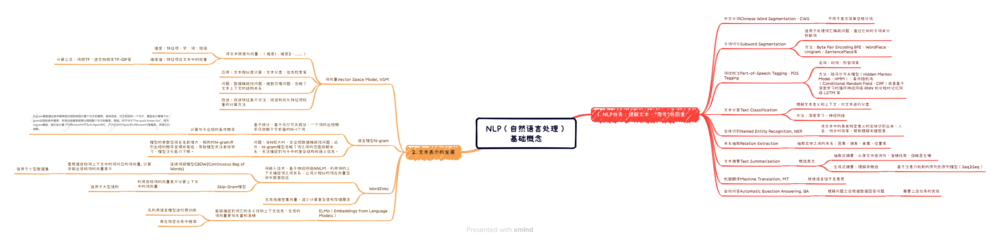

# HappyLLM打卡1：NLP的基本概念

很高兴参与了这次datawhale的学习活动，学习LLM知识，附上课程链接：[从零开始的大语言模型原理与实践教程](https://github.com/datawhalechina/happy-llm)

今天学的是第一章基本概念，所以就做了个简单的思维导图：[NLP（自然语言处理）基础概念.pdf](../../admin/pdf/NLP_basic_concepts.pdf)

附上图片：

分享我之前看过的讲解transformer那篇论文的视频，还是挺不错的：[【《Attention Is All You Need》论文解读】](https://www.bilibili.com/video/BV1pr421t73G/?share_source=copy_web&vd_source=e923e6f61c09c08ce6708e327c42103a)
