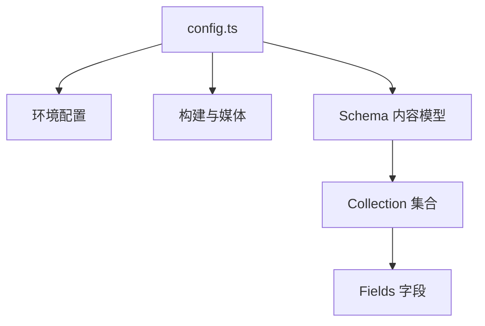

# 深度解析：TinaCMS 的大脑 `config.ts`

是的，你完全掌握了重点！**`tina/config.ts`** 就是 TinaCMS 的大脑和控制中心。
它决定了你的 CMS 后台长什么样、能管理哪些文件、以及每个文件里能填什么内容。

这个文件主要由三个核心部分组成：**环境配置**、**构建配置**、**Schema（内容模型）**。

## 1. 核心结构概览



## 2. 关键配置项详解

### A. 连接云端 (Environment)

```typescript
export default defineConfig({
  branch, // 告诉 Tina 应该修改 GitHub 上的哪个分支
  clientId: process.env.NEXT_PUBLIC_TINA_CLIENT_ID, // 你的项目 ID
  token: process.env.TINA_TOKEN, // 你的访问令牌
  // ...
})
```
这部分就像是“登录凭证”。当你把网站部署上线时，它确保 Tina 能有权限去读写你的 GitHub 仓库。

### B. 告诉 Tina 文件在哪 (Build & Media)

```typescript
build: {
  outputFolder: "admin",      // 编译后的后台文件放哪？(自动生成)
  publicFolder: "docs/public" // 网站的静态资源目录在哪？
},
media: {
  tina: {
    publicFolder: "docs/public", // 图片上传到哪？
    mediaRoot: "",               // 在 public 里的子目录 (空代表直接放根目录)
  },
}
```
这非常关键！它决定了你在后台上传图片时，图片会被保存到 `docs/public/` 下面，这样 VitePress 才能正确引用它。

### C. 定义内容模型 (Schema) - **这是我们要修改最多的地方**

Tina 使用 `collections`（集合）的概念来管理内容。一个集合通常对应磁盘上的一个文件夹。

```typescript
schema: {
  collections: [
    {
      name: "post",       // 集合的唯一 ID (程序用)
      label: "学习笔记",   // 后台显示的中文名 (人用)
      path: "docs/notes", // 这个集合管理哪个文件夹下的文件？
      
      // 字段定义：决定了你在编辑页面能看到哪些输入框
      fields: [
        {
          type: "string", // 字段类型：字符串文本框
          name: "title",  // 对应 markdown frontmatter 里的 key ( title: ...)
          label: "标题",   // 输入框左边的标签
          isTitle: true,  // 标记这个字段是文章的主标题
          required: true, // 必填
        },
        {
          type: "rich-text", // 字段类型：富文本编辑器
          name: "body",      // 对应 markdown 的正文内容
          label: "内容",
          isBody: true,      // 标记这个字段代表文件正文
        },
      ],
    },
    // 你可以在这里添加第二个 collection，比如 "随笔"
  ],
}
```

## 3. 常用字段类型 (Fields)

你可以给你的文章添加各种丰富的元数据，只要在这里加字段就行：

-   **`string`**: 单行文本框（用于标题、作者、分类）
-   **`rich-text`**: 正文编辑器
-   **`image`**: 图片上传器（用于封面图）
-   **`boolean`**: 开关（用于“是否置顶”）
-   **`datetime`**: 日期选择器（用于发布时间）
-   **`string` (list)**: 标签输入框（输入多个 tag）

### 举个栗子：添加“封面图”和“发布时间”

如果你想给文章加个封面和时间，只需修改 `fields` 数组：

```typescript
fields: [
  // ... 原有字段
  {
    type: "image",
    name: "cover",
    label: "封面图片",
  },
  {
    type: "datetime",
    name: "date",
    label: "发布时间",
  }
]
```

保存后，你的 CMS 后台就会立马多出这两个选项！

## 总结

`tina/config.ts` 本质上就是一份 **“说明书”**：
1.  它告诉 Tina 去哪里找文件 (`path`)。
2.  它告诉 Tina 每个文件长什么样 (`fields`)。
3.  它告诉 Tina 上传的图片放哪里 (`media`)。

## 4. 常见误区：CMS 不是文件管理器

你可能会发现，在 TinaCMS 的后台里，你**无法拖拽移动文件**，也无法**重命名文件夹**。

这是有意设计的：
-   **TinaCMS (编辑者)**：专注于**写内容**、**改错别字**、**换图片**。
-   **VS Code (开发者)**：专注于**架构调整**、**目录重构**、**文件迁移**。

**最佳工作流**：
如果你想把一篇文章从“笔记”移动到“随笔”：
1.  **不要在 CMS 里找按钮**（找不到的）。
2.  回到你的电脑文件夹（或 VS Code），直接剪切粘贴文件。
3.  修改 `tina/config.ts` 确保新位置也被配置了 Collection。
4.  重启/刷新 Tina，它会自动识别新位置的文件。
