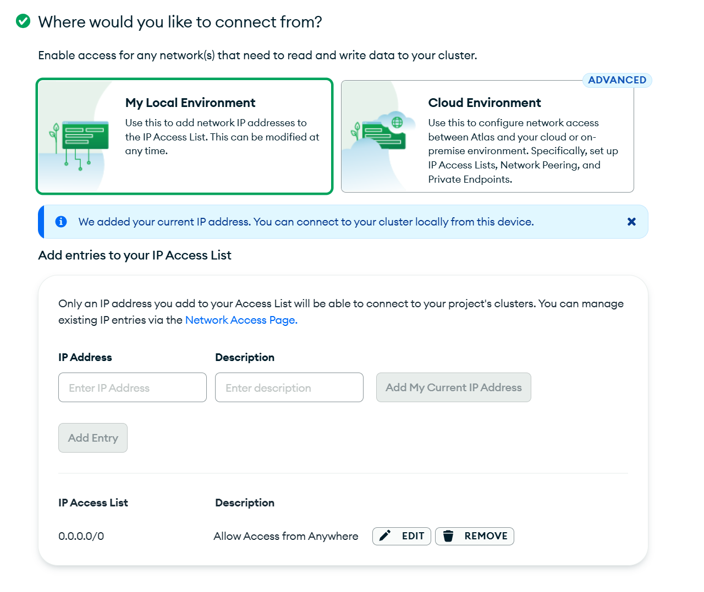
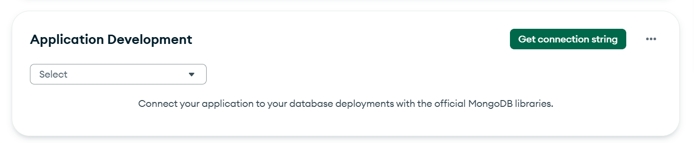
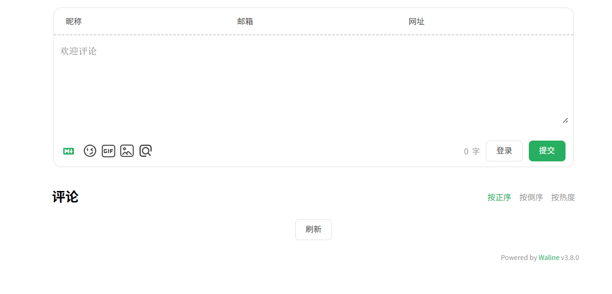

# 实战：为 VitePress 接入 Waline 评论系统 (MongoDB 版)

Waline 是一款功能强大的评论系统，我们将采用 **Vercel (服务端) + MongoDB Atlas (数据库)** 的组合。这是一个非常经典且稳健的**免费**架构。

## 核心概念：服务器 vs 数据库

在开始之前，理解这两个角色的分工有助于您明白我们在做什么：

*   **服务器 (Server)**：由 **Vercel** 扮演。
    *   它像一个**“管家”**。负责接收网页发来的评论请求、过滤垃圾信息、发送邮件通知等逻辑处理。它只处理计算，不负责永久存储。
*   **数据库 (Database)**：由 **MongoDB Atlas** 扮演。
    *   它像一个**“仓库”**。它只负责存放每一条评论的数据。不管服务端重启多少次，只要数据库在，数据就在。

---

## 第一步：创建此数据库 (MongoDB Atlas)

我们需要先准备好“仓库”。

1.  访问 [MongoDB Atlas 官网](https://www.mongodb.com/cloud/atlas/register) 并注册账号（推荐直接用 Google 账号登录）。
2.  **创建集群 (Cluster)**：
    *   中间可能会有几个问卷，随便选。
    *   看到价格页面时，务必选择右侧的 **"M0" (Free Forever / 永久免费)** 套餐。
    *   **Provider**: 选 AWS。
    *   **Region**: 选一个离您或者您大部分读者近的地方（比如 Singapore 或 Tokyo，如果没有就选 N. Virginia）。
    *   点击底部绿色的 **"Create"** 按钮。
3.  **创建数据库用户 (Security Quickstart)**：
    *   **Username**: 填一个名字，比如 `admin`。
    *   **Password**: [自动生成] 或者自己设一个复杂的。**👉 务必把这个密码复制下来记在记事本上！**
    *   点击 **"Create User"**。
4.  **设置网络访问 (Network Access)**：
    *   
    *   **关于这里的选择**：如果您看到的界面是 "My Local Environment" 和 "Cloud Environment" 二选一：
        *   **请不要**点击复杂的 Cloud Environment (VPC Peering)。
        *   直接在下面的 IP Address 列表里，点击 **"Allow Access from Anywhere"** 按钮。
        *   或者手动输入 IP 地址：`0.0.0.0/0`。
    *   在 "Where would you like to connect from?" 下面。
    *   选择 **"Allow Access from Anywhere"** (也就是 0.0.0.0/0)。*这也是为了让 Vercel 能连上它。*
    *   点击 **"Finish and Close"**。
5.  **获取连接字符串 (Connection String)**：
    *   
    *   等待集群创建完毕（变为绿色具体的各种指标图表）。
    *   点击界面上的 **"Connect"** 按钮。
    *   选择 **"Drivers"**。
    *   您会看到一串代码，类似：`mongodb+srv://admin:<db_password>@cluster0.xxxxx.mongodb.net/?retryWrites=true&w=majority&appName=Cluster0`
    *   **👉 复制这串代码**。
    *   手动把代码里的 `<db_password>` 替换成刚才步骤 3 里记下的**真实密码**。
    *   **这就是您的 `MONGO_URI`，请保管好！**

---

## 第二步：部署服务端 (Vercel) —— 纯净手动方案

由于 Waline 官方仓库结构复杂，直接 Fork 容易导致 Vercel 配置错误（如 pnpm 锁文件冲突、根目录设置错误等）。
我们推荐最稳妥的**“手动建仓库”**方案，**零冲突，一次成功**。

### 2.1 在 GitHub 创建新仓库
1.  登录 GitHub，点击右上角 `+` -> **New repository**。
2.  起个名字，比如 `my-waline`。
3.  点击 **Create repository**。

### 2.2 创建核心文件 (共3个)
我们需要手动创建3个文件，直接在网页上操作点击 **Add file** -> **Create new file** 即可。

**文件1：`package.json`** (放在根目录)
这是告诉 Vercel 我们需要安装什么依赖。
```json
{
  "dependencies": {
    "@waline/vercel": "latest",
    "waline": "latest"
  }
}
```

**文件2：`vercel.json`** (放在根目录)
这是告诉 Vercel 把所有请求都转发给代码处理。
```json
{
  "version": 2,
  "rewrites": [
    { "source": "/(.*)", "destination": "/api/index.js" }
  ]
}
```

**文件3：`api/index.js`** (注意输入文件名时带上 api/ 前缀)
这是真正的程序入口。
```javascript
/* eslint-disable @typescript-eslint/no-var-requires */
const Application = require('@waline/vercel');

module.exports = Application({
  env: 'vercel',
  app: 'app',
});
```

### 2.3 在 Vercel 部署
1.  访问 [Vercel 仪表盘](https://vercel.com/dashboard) -> **Add New...** -> **Project**。
2.  导入刚才创建的 `my-waline` 仓库。
3.  **Framework Preset**: 选 `Other`。
4.  **Root Directory**: 保持默认 `./` (不要改)。
5.  **Environment Variables**:
    *   **Name**: `MONGO_URI`
    *   **Value**: 填入第一步获得的 MongoDB 连接字符串。
6.  点击 **Deploy**。

### 2.4 验证
部署完成后，点击 **Visit** 按钮。
*   访问 `您的地址/ui` (例如 `https://xxx.vercel.app/ui`)。
*   如果看到了登录/注册界面，说明服务端部署成功！

---

## 第三步：前端接入 (更新代码)

1.  **安装依赖**：
    ```bash
    npm install @waline/client
    ```

2.  **配置组件**：
    打开 `docs/.vitepress/theme/components/Comment.vue`，找到 `serverURL` 字段，将其修改为您刚才在 Vercel 获得的新地址。

    ```javascript
    walineInstance = init({
        el: '#waline',
        serverURL: 'https://您的-waline-地址.vercel.app', // <--- 修改这里
        dark: 'html.dark',
    });
    ```

3.  **重启本地服务**：
    `npm run dev`，查看效果。
    
    如果成功的话，点击visit应该出现这样的画面:
    

---

## 常见问题

*   **部署时报错 "Lockfile mismatch"？**
    *   这是使用了官方仓库导致的。请改用上述的“纯净手动方案”，自己建仓库，不含锁文件，绝对不会报错。
*   **访问 /ui 出现 404？**
    *   说明 `vercel.json` 配置没生效。请确认您添加了上述教程中的 `vercel.json` 文件，并配置了 `rewrites`。
*   **访问 /ui 出现 500 Error？**
    *   这通常是数据库连接失败。
    *   请检查 `MONGO_URI` 里的**密码**是否正确（不能包含 `< >`）。
    *   请检查 MongoDB Atlas 的 **Network Access** 是否开启了 `0.0.0.0/0` (Allow Access from Anywhere)。
*   **前端提示 CORS 跨域错误？**
    *   这通常不是真的跨域问题，而是服务端挂了（返回 404 或 500 时，浏览器会报 CORS）。请优先解决服务端 /ui 无法访问的问题。
*   **Waline 服务端和之前的 Cloudflare AI 是一样的吗？**
    *   **不一样**。这是一个典型的**“混合云”**架构。
    *   **Cloudflare Worker (AI)**：像个“传话筒”。它只负责转发请求给大模型，自己不存数据（无状态）。
    *   **Vercel + MongoDB (Waline)**：像个“带仓库的管家”。**MongoDB** 负责永久存储评论数据，**Vercel** 负责处理逻辑。
